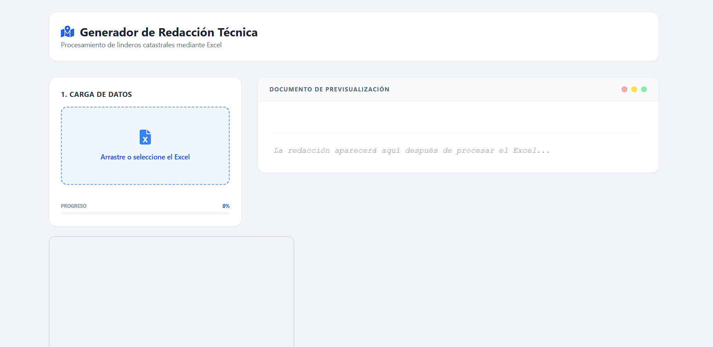
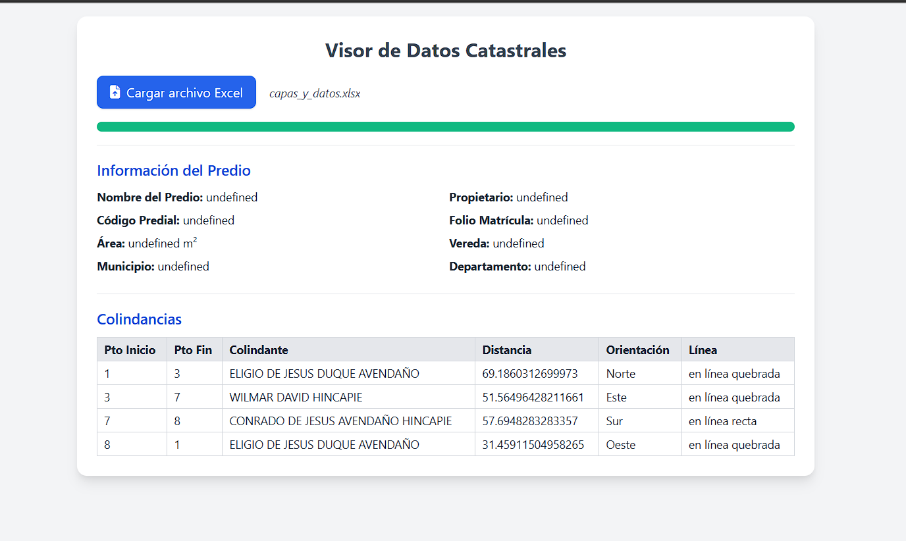

# Visor de Datos Catastrales 📊

**Autor:** Elkin Murillo Torres  
**Contacto:** rastaw28@gmail.com | [GitHub: Rammsteinlion](https://github.com/Rammsteinlion)

---

## 📌 Descripción

Aplicación web para visualizar datos catastrales desde archivos Excel de manera sencilla e intuitiva. La aplicación permite:

- Mostrar información detallada del predio (nombre, código, área, ubicación).  
- Consultar datos completos del propietario.  
- Explorar las colindancias del terreno con detalles de puntos, distancias y orientación.

---

## 🛠 Tecnologías

- **HTML5 y CSS (Tailwind):** Estructura y estilos responsivos.  
- **JavaScript:** Lógica de la aplicación y manipulación del DOM.  
- **SheetJS (xlsx):** Lectura y análisis de archivos Excel.  
- **FileReader API:** Carga de archivos locales en el navegador.

---

## 🚀 Instalación y Uso

1. Clona o descarga este repositorio.  
2. Dar click en el archivo nombrado `index.html` y se abrira en tu navegador por defecto.
3. Selecciona el archivo Excel con datos catastrales.  
4. Visualiza automáticamente la información organizada en la interfaz.
---

## 📸 Vista Previa

<p align="left">
  
  
</p>

---

## 🗂 Estructura del Proyecto

```plaintext
proyecto/
├── index.html       # Interfaz principal archivo de inicio
├── main/
│   └── main.js      # Lógica de procesamiento de datos
├── image/
│   └── image.png 
        image2.png     # Captura de pantalla de la aplicación
